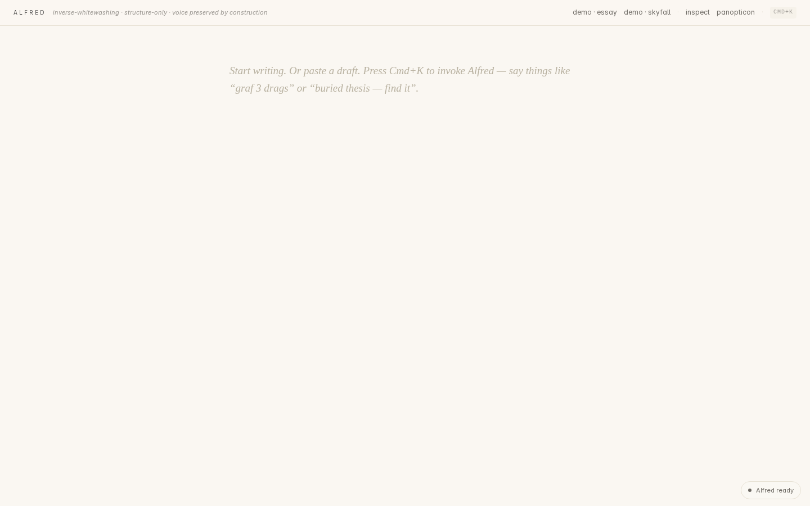
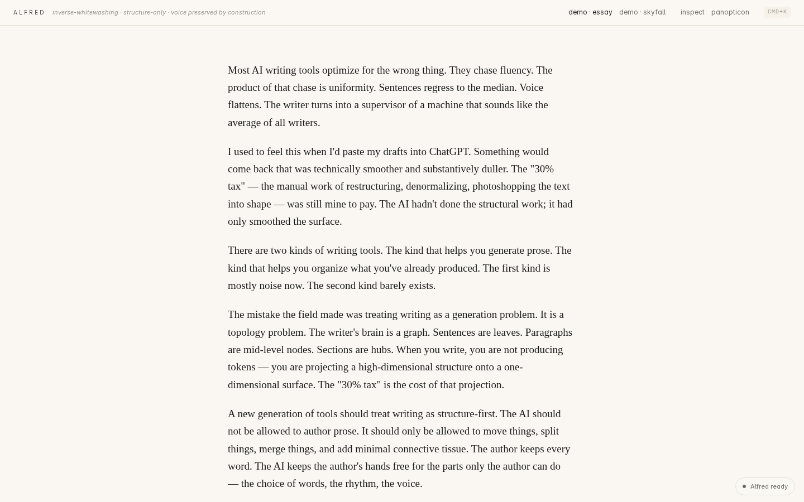
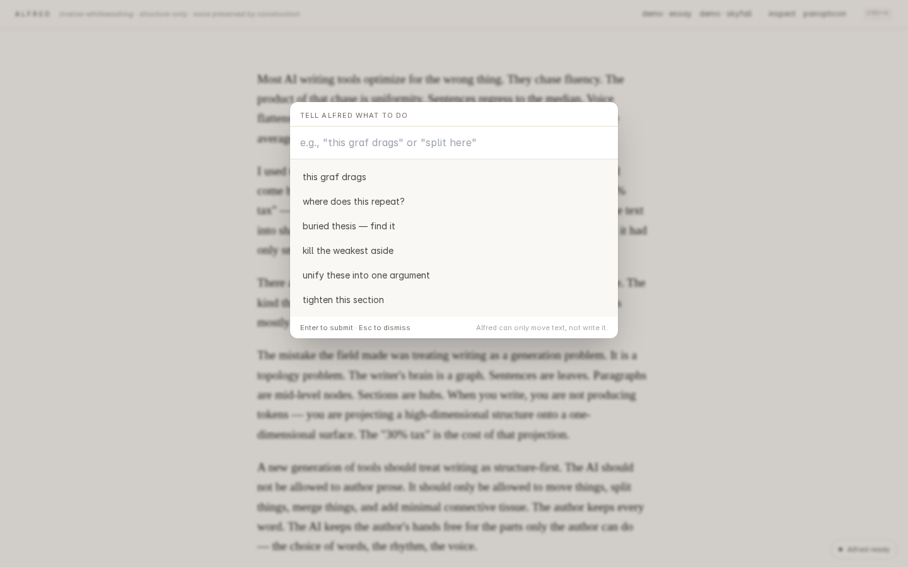
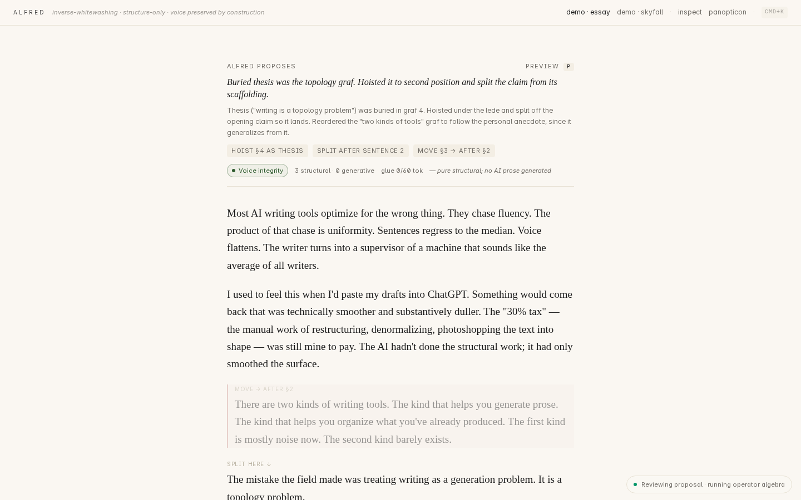
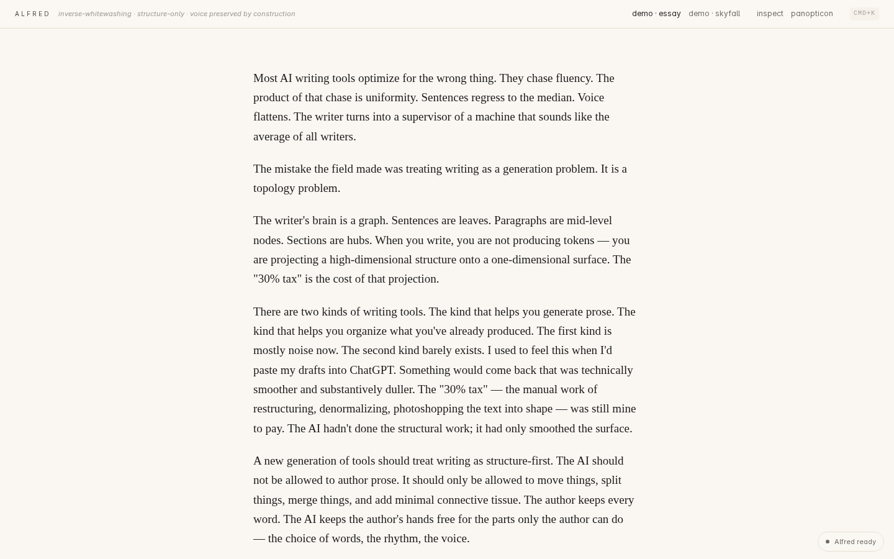
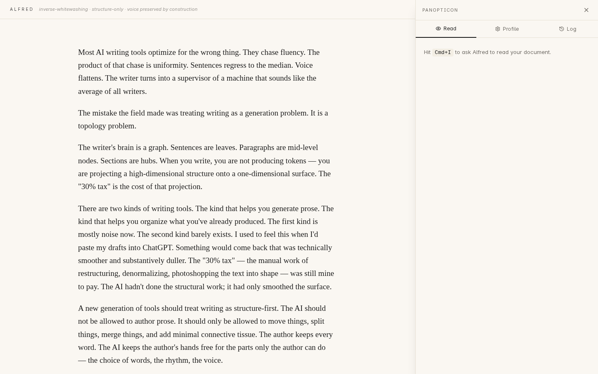
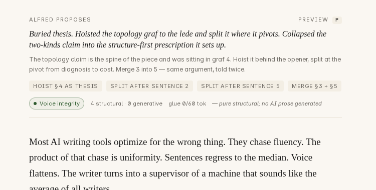
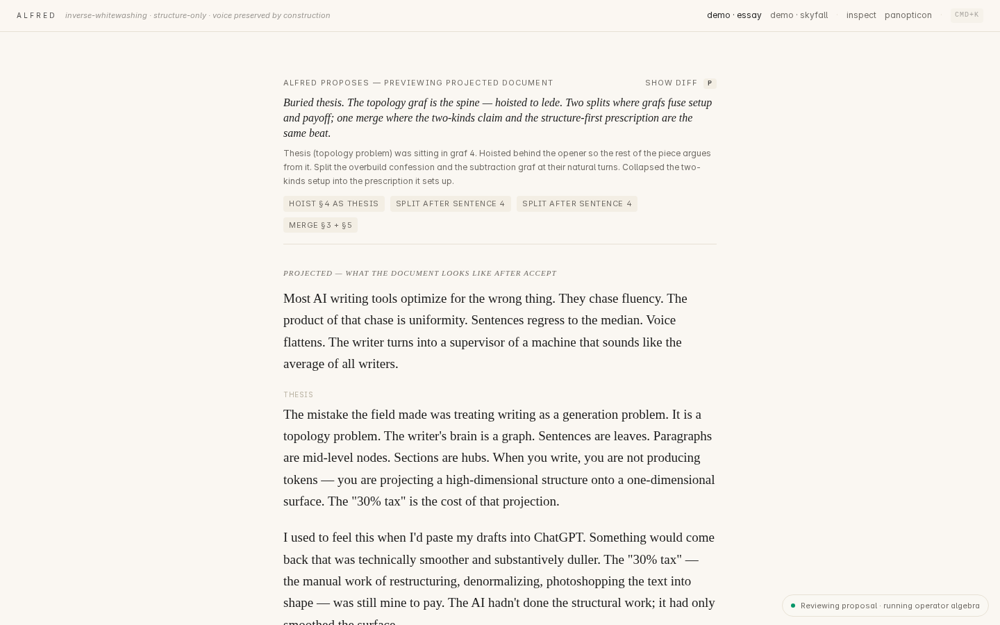

# Alfred

> Inverse-whitewashing. A writing environment where Claude Opus 4.7 is constrained to operate on **document structure**, never on prose. Voice is preserved by construction.

Alfred is the Anthropic Opus 4.7 hackathon submission for the **"Build for What's Next"** track.

## What it does

Most AI writing tools generate prose. They're great at average sentences. They flatten voice. The result is "whitewashing" — your writing returns to you smoother and duller.

Alfred inverts that. Claude is given a **fixed operator algebra** — `split`, `merge`, `move`, `hoist`, `demote`, `migrate`, `glue` — and is architecturally forbidden from authoring free prose. It can move your text around. It can collapse redundancies. It can promote a buried thesis. It cannot rewrite your sentences.

The result: a tool that helps with structure without touching voice. The author keeps every word.

The architecture is enforced by a **Voice Guardian** that validates every proposal before showing it: glue text is capped at 15 tokens per operator (60 total), forbidden tokens are blocked, and the only operator that may rewrite words (`migrate`, used for reprojecting older fragments into your current voice frame) is capped at 50% token-edit distance.

A side panel — the **Panopticon** — shows you, in real time, what Alfred has learned about how you write. Your voice profile is a flat file you can edit, export, or delete. The model's model of you is yours.

## Two transports

Alfred ships two interchangeable orchestration backends behind one identical product surface. The thesis (action-space constraint, Voice Guardian, Panopticon transparency) is **transport-independent** — switch by env var, no other code changes, frontend can't tell.

- **Messages API** (default, `ALFRED_MODE=messages`) — `client.messages.create` with `tool_choice: { type: "any" }`, prompt caching via the `prompt-caching-2024-07-31` beta. Lowest friction for local dev.
- **Managed Agents** (`ALFRED_MODE=agents`, on branch `managed-agents`) — agent definition (system prompt + 9 custom tools) provisioned once via `client.beta.agents.create`; per-document sessions via `client.beta.sessions.create`; per-Cmd+K invocation via `client.beta.sessions.events.stream`. Stateful at Anthropic, persistent across server restarts.

Both transports share the operator algebra, prompts, Voice Guardian, profile manager, and `Proposal` envelope. See `docs/managed-agents.md` (on the `managed-agents` branch) and `MERGE_PLAN.md` for the architecture and procedure.

## Screenshots

| Cold open | Loaded draft |
|---|---|
|  |  |

| Command palette | Alfred's proposal (diff overlay) |
|---|---|
|  |  |

| Post-accept (voice unchanged, structure improved) | Panopticon |
|---|---|
|  |  |

| Voice integrity badge (the architectural claim, made concrete) | Preview-projected (`P` to toggle) |
|---|---|
|  |  |

## Hotkeys

- `Cmd+K` — natural-language invocation. *"this graf drags"*, *"unify these into one argument"*, *"buried thesis — find it"*.
- `Cmd+I` — inspect (Alfred reads the document, reports structure).
- `Cmd+.` — open/close the Panopticon (writer-profile dashboard).
- `Tab` / `Esc` — accept / reject the proposed diff.
- `Cmd+Esc` — cancel an in-flight propose.

**Operator-specific hotkeys** (require text or paragraph selection in the editor):

- `Cmd+S` — split selected graf at sentence boundary
- `Cmd+M` — merge selected grafs
- `Cmd+H` — hoist to intro/thesis
- `Cmd+J` — demote under parent claim
- `Cmd+B` — move (Alfred picks better position)

Selected paragraph IDs flow into the propose request as `selection.paragraph_ids`; the same Voice Guardian validates the result.

## Demo flow (90s)

1. Hit the **demo · essay** button. A messy 600-word draft loads.
2. Press `Cmd+K`. Type *"this graf drags"* or *"buried thesis — find it"*.
3. Alfred returns a ghost diff: a `hoist` operation moving the buried claim to the lede, plus minimal glue. Your words, different position. Voice unchanged.
4. Press `Tab` to accept, `Esc` to reject.
5. Press `Cmd+.` to open the Panopticon. See what Alfred just learned about you.
6. Hit **demo · skyfall**. Fragments from different voice frames load. Press `Cmd+K`, type *"unify these into one argument"*. Alfred emits two `migrate`s and a `merge`, reprojecting the older fragments into your current voice frame.

## Quick start

```bash
# requires Node 22+ and an Anthropic API key
export ANTHROPIC_API_KEY=sk-ant-...

npm run install:all
npm run dev
```

Frontend on `http://localhost:5173`, backend on `http://localhost:3001`.

To verify everything is wired correctly, in another terminal:

```bash
npm run smoke
```

Walks the full lifecycle (health → propose → decide → inspect → profile) and prints the actual `alfred_says` it received. ~12 seconds round-trip.

## Architecture

A single Alfred orchestrator runs as a long-lived per-session managed agent. The document, the user's `.proserc`, and the hoarded few-shot buffer (last N accept/reject decisions) all live in Claude's context window — no vector DB, no knowledge graph, no AST parser. The model's KV cache is the database.

```
Browser (Tiptap editor)
  ↓ /api/propose
Backend
  ↓ Anthropic Messages API + tool_use
Claude Opus 4.7 (one prompt: system + profile + document + hoarded + intent)
  ↓ tool calls
Voice Guardian validation (glue budget · forbidden tokens · migrate Δ ≤ 50%)
  ↓ Proposal envelope
Diff overlay (Tab/Esc)
  ↓ accept/reject
Voice profile updated → next call sharper
```

See `ARCHITECTURE.md`, `OPERATORS.md`, `SPEC.md` for full detail.

## Hackathon prizes targeted

- **Build for What's Next** — Logomorphic interaction is an interface paradigm without a name; Alfred is the first instance.
- **Most Creative Opus 4.7 Exploration** — Opus is repositioned as a *structural reader and operator emitter*, never a content generator.
- **Keep Thinking** — Nobody pointed Claude at the topology of writing rather than its prose.
- **Best Use of Managed Agents** — One Alfred per session, persistent, sustained, shippable.

## What's not in v1 (and why)

- **No fine-tuning yet.** The data flywheel exists (every accept/reject becomes a signal); per-user LoRA via Prime Intellect Lab is Phase 3, post-hackathon.
- **No graph viz.** The structural model lives in Claude's context, not on screen. The page stays blank.
- **No multi-agent fan-out.** A single contoured Alfred orchestrator. Multi-agent architectures lose context by the terabit.
- **No autocomplete / ghost text.** Alfred only acts when invoked.
- **No accounts, cloud, mobile, dark mode.** Single user, local files, warm paper.

## Storage

Alfred reads and writes only inside `~/.alfred/`:

```
~/.alfred/
  proserc.md            # human-editable: vibe_anchor + forbidden_tokens
  voice-profile.json    # learned preferences (machine-written, human-correctable)
  sessions/
    <session>.md        # markdown log of every proposal & decision
```

You own all of it.

## License

MIT. Ship it.
